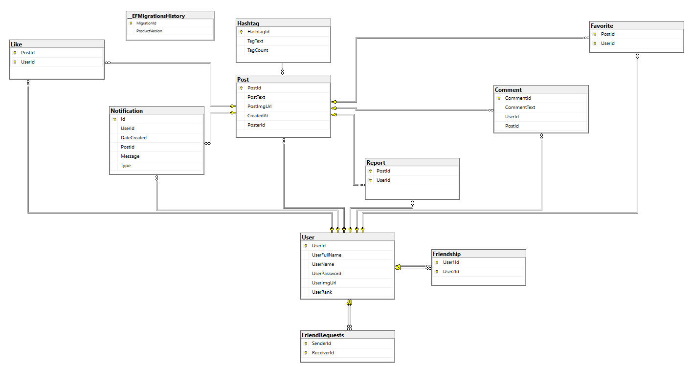

# Social Petwork

Social network application for pets and owners developed using ASP.NET MVC, Microsoft SQL Server and Tailwind CSS.

### Core Features
- **Stories and Posts**: Essential social media features such as stories, posts, friends etc.
- **Likes, Shares, and Favorites**: Functionality for users to like, share, and favorite posts.
- **Friend Requests Management**: Manage friend requests, including adding, canceling, ignoring, and approving requests.
- **Trending Section**: A section to highlight the most used hashtags, keeping your platform current and engaging.
- **Dynamic Web Pages**: With AJAX implementation, application features can be done without page refreshing.
- **Real-Time Notifications**: Real-time notification delivery functionality has been implemented using SignalR for immediate notification transmission.

### Front-End Design with Tailwind CSS
- Visually appealing and user-friendly interface using Tailwind CSS.
- Tailwind's utility-first approach to create responsive and modern layouts effortlessly.

### Back-End Design with ASP.NET MVC Framework
- ASP.NET MVC framework for a clear separation of concerns and a maintainable codebase.

### Data Management with ASP.NET Data Project and Entity Framework
- Manage your data efficiently with ASP.NET Data Project and Entity Framework.
- Database schema Implementation with Entity Framework migrations.

## The Relational Schema of The Database


### Requirements
- Visual Studio
- .NET SDK
- Microsoft SQL Server

### Installation
1. **Clone the Repository**:
    ```bash
    git clone https://github.com/B4rakH/SocialPetwork.git
    ```
2. **Navigate to the Project Directory**:
    ```bash
    cd SocialNetwokForPets
    ```
3. **Install Dependencies**:
    ```bash
    dotnet restore
    ```
4. **Set Up Database**:
    - Update the `appsettings.json` with your SQL Server connection string.
    - Run the following command to apply migrations:
    ```bash
    dotnet ef database update
    ```

### Running the Application
1. **Build and Run**:
    ```bash
    dotnet run
    ```
2. **Open Your Browser** and navigate to `http://localhost:5000`.
